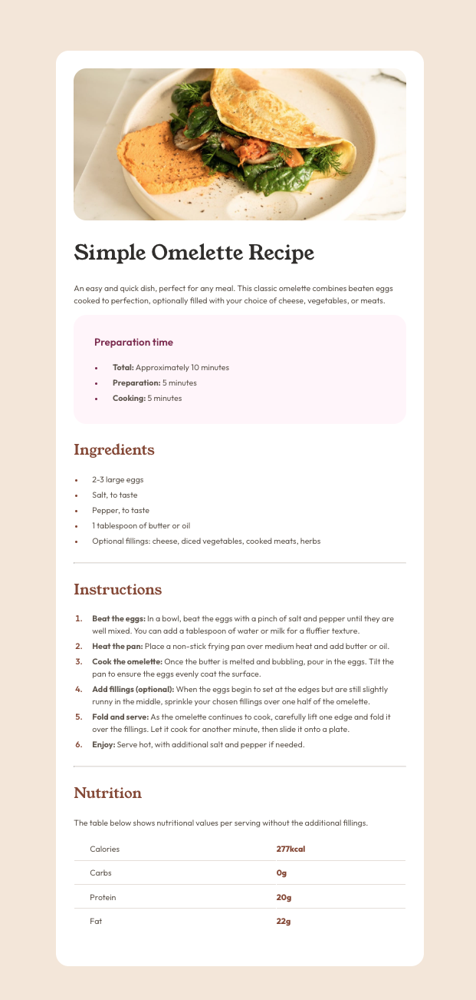

# Frontend Mentor - Recipe page solution

This is a solution to the [Recipe page challenge on Frontend Mentor](https://www.frontendmentor.io/challenges/recipe-page-KiTsR8QQKm). Frontend Mentor challenges help you improve your coding skills by building realistic projects.

## Table of contents

- [Overview](#overview)
  - [The challenge](#the-challenge)
  - [Screenshot](#screenshot)
  - [Links](#links)
- [My process](#my-process)
  - [Built with](#built-with)
  - [What I learned](#what-i-learned)
  - [Continued development](#continued-development)

## Overview

### Screenshot

### Links

- Solution URL: https://github.com/Saekit/FM-Recipe-Page
- Live Site URL: https://saekit.github.io/FM-Recipe-Page/

## My process

### Built with

- Semantic HTML5 markup
- CSS custom properties
- Flexbox
- CSS Grid
- Mobile-first workflow
- [React](https://reactjs.org/) - JS library
- [Vite](https://vitejs.dev/) - React framework
- [Styled Components](https://styled-components.com/) - For styles

### What I learned

I learned a little bit more about styled components.

### Continued development

I know there is still much more I need to learn about styled components and CSS, so I am going to continue to develop those skills.
